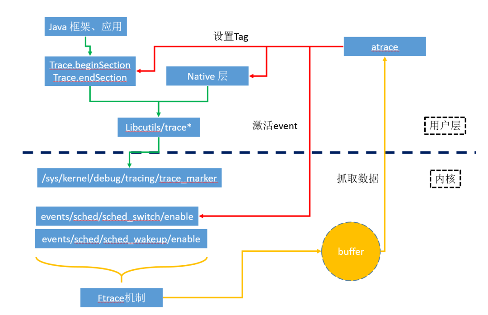
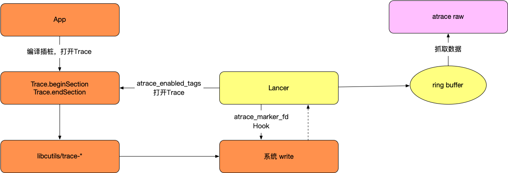

# Lancer

前段时间在学习 JNI 和 APM 相关知识（更多信息可以查看[关于学习 JNI 和 APM 需要了解的基础知识](https://github.com/YoungTr/Swan)，建立完整的知识体系），codelang 大佬发了一篇文章给我，我俩一拍即合准备自己实现一下，主要也是想通过一个实战来检验一下之前的学习成果。

[打造一款支持线上抓 systrace 的框架](https://mp.weixin.qq.com/s/S49Fz1wPxqe2ua3PiTvIjg)

这里主要简述一下 Lancer 的实现过程。

### 实现目标

* 不依赖 PC 抓取 Trace

### Systrace 概述



Systrace 抓取 Trace 信息最终都是通过调用 Android SDK 提供的 `Trace.beginSection` 或者 `ATRACE_BEGIN` 记录到同一个文件 `/sys/kernel/debug/tracing/trace_marker` 。

那么实现不依赖 PC 抓取 Trace 需要解决这么几个问题：

* 方法的前后自动插入 Trace.beginSection 和 Trace.endSection 方法
* 如何打开 Trace 开关？
* 如果获取 atrace 的数据信息？

### 实现方式

上面提出的几个问题都有了解决方案：

* 方法插入可以在编译期间插桩实现
* atrace 通过 `atrace_enabled_tags `  每一位控制一种事件类型，可以获取该变量的地址，重新设置需要打开事件的值即可
* atrace 数据实时写入 fd 为 `atrace_marker_fd ` 的文件中，只需 hook 系统 `write` 方法，对比 fd 的值是否和 `atrace_marker_fd ` 相同即可

大致流程如下：



*1. StarTrace*

```c++
int32_t ATrace::StarTrace() {
    int64_t start = elapsedRealtimeMicros();

    if (atrace_started_) {
        return OK;
    }

    if (!PostCreateTrace(TraceProvider::Get().GetBufferSize())) {
        return START_WRITE_TRACE_FAILED;
    }

    int32_t result = InstallProbe();
    if (result != OK) {
        LOGD("failed to install atrace, error: %d", result);
        return result;
    }

    auto prev = atrace_enable_tags_->exchange(DEFAULT_ATRACE_TAG);
    if (prev != UINT64_MAX) {
        original_tags_ = prev;
    }

    atrace_started_ = true;
    int64_t cost_us = elapsedRealtimeMicros() - start;
    LOGD("start trace cost us: %lld", cost_us);
    return OK;
}
```

`startTrace` 调用 `InstallProbe()` 方法，`InstallProvbe`主要干了这件事：

* hook 系统 `write` 方法

* 获取 `atrace_enabled_tags` 和 `atrace_marker_fd` 的地址
* 打开 `atrace_enabled_tags` 开关

 *1.1 HookForAtrace* : hook 系统 `write` 方法

```c++
    ssize_t (*original_write)(int fd, const void *const __pass_object_size0 buf, size_t count);

    ssize_t my_write(int fd, const void *const buf, size_t count) {
        if (ATrace::Get().IsATrace(fd, count)) {
            ATrace::Get().LogTrace(buf, count);
            return (ssize_t) count;
        }
        return original_write(fd, buf, count);
    }

    ssize_t (*original_write_chk)(int fd, const void *const __pass_object_size0 buf, size_t count,
                                  size_t buf_size);

    ssize_t my_write_chk(int fd, const void *const buf, size_t count, size_t buf_size) {
        if (ATrace::Get().IsATrace(fd, count)) {
            ATrace::Get().LogTrace(buf, count);
            return (ssize_t) count;
        }
        return original_write(fd, buf, count);
    }

    void hook_libc() {
        xhook_register(".*libc\\.so$", "write", (void *) my_write, (void **) (&original_write));
        xhook_register(".*libc\\.so$", "__write_chk", (void *) my_write_chk,
                       (void **) (&original_write_chk));
        xhook_refresh(1);
    }

    void HookBridge::HookForAtrace() {
        hook_libc();
    }
```

* 使用 xHook hook 系统 `write` 和 `__write_chk` 方法 

*1.2 InstallAtraceProbe*：获取 `atrace_enabled_tags` 和 `atrace_marker_fd`

```c++
int32_t ATrace::InstallAtraceProbe() {

    void *handle;
    if (nullptr == (handle = dlopen(nullptr, RTLD_GLOBAL))) return INSTALL_ATRACE_FAILED;
    if (nullptr == (atrace_enable_tags_ = reinterpret_cast<std::atomic<uint64_t> *>(dlsym(handle,"atrace_enabled_tags")))) goto err;
    if (nullptr == (atrace_maker_fd_ =reinterpret_cast<int *>( dlsym(handle, "atrace_marker_fd")))) goto err;

    return OK;

   err:
    dlclose(handle);
    return INSTALL_ATRACE_FAILED;
}
```

* atrace_enabled_tags： 每一位表示一个事件的开关
* atrace_marker_fd： atrace 数据是实时写入 fd 为 `atrace_marker_fd ` 的文件中
* 这些都是公开的 NDK API ，所以可以直接使用系统的 dlopen 和 dlsym 方法获取

*1.3 打开 atrace 开关*：

```c++
auto prev = atrace_enable_tags_->exchange(DEFAULT_ATRACE_TAG);
if (prev != UINT64_MAX) {
  original_tags_ = prev;
}
```

通过上面的设置，atrace 开关已经打开了，并且可以获取系统 write 的数据。

*2. 格式化 trace*

```c++
ssize_t my_write(int fd, const void *const buf, size_t count) {
  if (ATrace::Get().IsATrace(fd, count)) {
    ATrace::Get().LogTrace(buf, count);
    return (ssize_t) count;
  }
  return original_write(fd, buf, count);
}
```

* 如果是 atrace 的数据则获取数据写入文件

*2.1 LogTrace*

```c++
void ATrace::revolveTrace(const char *trace, bool begin) {
    char tmp_buf[kAtraceMessageLen] = {0};
    int pid = gettid();
    std::string thread_name = GetThreadName(pid);
    int len;
    double sec = CurrentTime();
    if (begin) {
        len = snprintf(tmp_buf, sizeof(tmp_buf), "%s-%d [000] ...1 %.6f: tracing_mark_write: %s\n",
                       thread_name.c_str(), gettid(), sec, trace);
    } else {
        len = snprintf(tmp_buf, sizeof(tmp_buf),
                       "%s-%d [000] ...1 %.6f: tracing_mark_write: E\n", thread_name.c_str(),
                       gettid(), sec);
    }

//    LOGD("tmp_buf content: %s", tmp_buf);
    Logger::get().writeBytes(
            EntryType::STRING_NAME,
            0,
            (const uint8_t *) tmp_buf,
            len);
}

void ATrace::LogTrace(const void *buf, size_t count) {
    const char *msg = (const char *) buf;
    switch (msg[0]) {
        case 'B':
            revolveTrace((const char *) buf, true);
            break;
        case 'E':
            revolveTrace((const char *) buf, false);
            break;
        default:
            return;
    }
}
```

* 按照特定格式格式化数据，这里需要获取线程的名称，使用 map 缓存线程名称。线程的名称可以到 `/proc/%d/comm` 中获取

一条完整的 atrace 数据为：

```
.sample.android-19452 (19452) [005] .... 1308823.801863: tracing_mark_write: B|19452|activityStart
......
.sample.android-19452 (19452) [005] .... 1308824.801753: tracing_mark_write: E|19452
```

*3、write trace*

```c++
      Logger::get().writeBytes(
              EntryType::STRING_NAME,
              0,
              (const uint8_t *) tmp_buf,
              len);
```

* 这里使用 `RingBuffer` 来做缓存，避免大量重复的 I/O 操作

总体来说，实现过程还是比较简单的，后续会更新其它 APM 的实战项目，感兴趣的可以关注 [关于学习 JNI 和 APM 需要了解的基础知识](https://github.com/YoungTr/Swan)。
